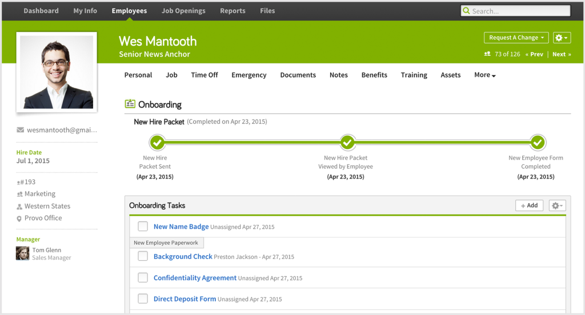
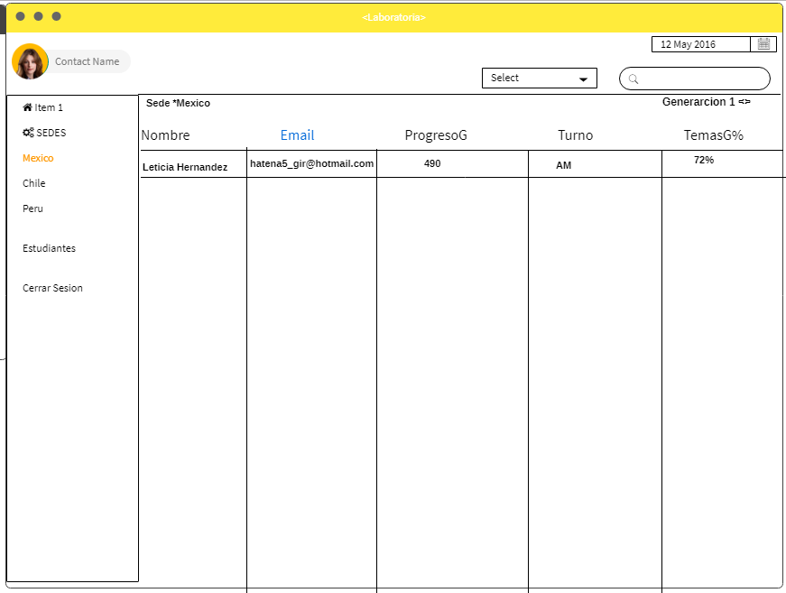
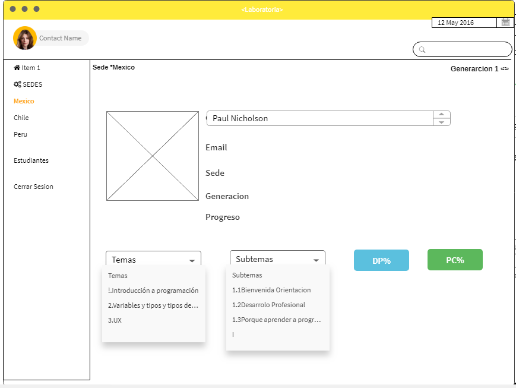
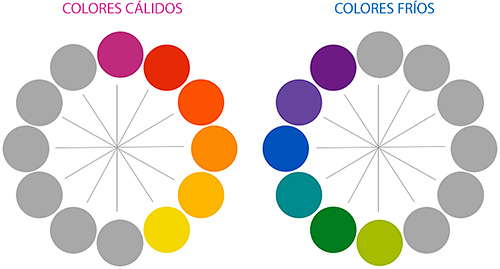
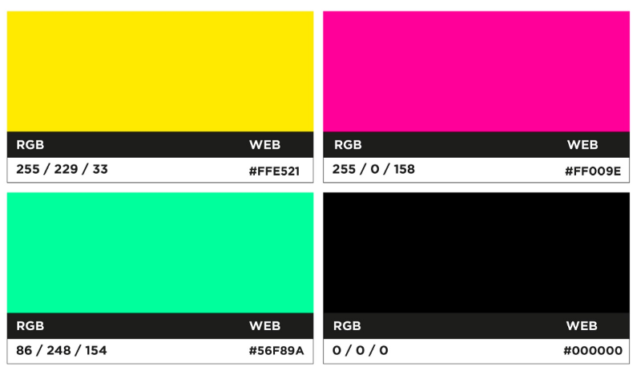
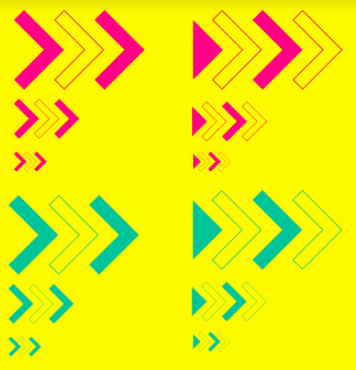
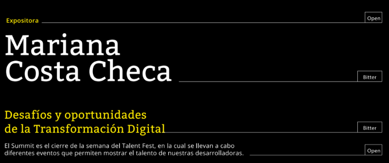
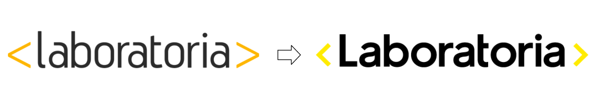

# **Data Dashboard**

## **Proceso de UX**

### **1. Descubrimiento e investigación**

Para poder recopilar todo la informacion realizamos [entrevistas]() que nos ayudaran a identificar el tipo de usuario a quien va dirigido nuestro proyecto y asi poder cumplir sus  necesidades.
Entrevistamos a los coach y Tm pues ellos son los que tienen mas interaccion con esta data, la informacion que mas utilizan  son las sedes y generaciones,resultados y desempeño de las alumnas , porcentajes alcanzados por cada una de ellas nos dimos cuenta que algunos tardan  mas de 5 horas interactuando con la informacion ,la organizacion de las carpetas no son muy agiles,ya que tienen que estar  buscando la informacion carpeta por carpeta y llegan a tardar demasiado tiempo buscando la informacion qu especificamente necesitan,la mayoria de ellos pasan mas tiempo en la computadora y cuando quieren utilizar la data en el celular se les hace aun mas complicado buscar algun dato.
El celular es  indispensale ya sea en nuestra vida social o en nuestra area de trabajo.Tambien nos comentaron que la informacion que visualizan solo les sirve una sola vez y cada que entran a la data esta cambia y tienen que volver a realizar el trabajo algo que se les hace muy abrumador nos dimos cuenta que ellos utilizan tablas y a algunos les gustaria visualizar la informacion en graficas pues tiene que contar manualmente el numero de egresadas que existen en la data,tambien les gustaria que su informacion se visualizara en forma ascendente y desendente para asi tener aun mejor organizacion en du data.

__Usuarias:__

Tener mejor accesibilidad encuanto a los datos y poder tener la informacion mas organizada ,reducir el tiempo de busqueda,no cuenta con una interfaz utilizan un programa basico que es Excel,no cuentan con un proceso establecido.Que pudiera tener un perfil en laboratoria para poder saber quienes son, su cargo, sus nombres.
Les gustaria contar con una interfaz que se mucho mas eficiente, poder visualizar graficas pero solo si hay necesidad de usarlas pues prefieran algo sencillo y facil de usar.Comparten la informacion por Google Drive y Spreadsheets.
Algunos usuario si han tenido acceso a otra data dashboard y para ellos es muy accesible como es [Bamboohr HR](https://www.bamboohr.com/api/documentation/login.php)

__Bamboohr__

__Objetivos de las usuarias:__
sus obetivos es poder reducir el tiempo y tener una busqueda de cada estudiante aun mas eficiente y Planificar y ejecutar el programa de formación.
Mantener un seguimiento del progreso de las estudiantes y según ello tomar las decisiones
necesarias para ofrecerles la mejor experiencia de aprendizaje.
Para conocer cómo están avanzando, darles feedback constante sobre su desempeño y
facilitar su desarrollo.

__Sentimientos:__
desesperacion ,suelen abrumarse y enojo ,frustracion.

__Técnicas usadas en esta fase:__

 [Entrevistas](https://drive.google.com/drive/folders/1NGN5DL7N93bDsT0IKapJ2dGG7A-etu7q).

__5. Objetivos del negocio:__

Que las estudiantes construyan en 6 meses los skills técnicos y socioemocionales para
insertarse en el mundo tech e iniciar su carrera ,es el objetivos de Laboratoria a largo plazo, nuestra vision es ser la principal fuente de talento tech femenino de america latina para el mundo. Ofrecer una educación de calidad y encontrar
el talento que necesita el sector, encontrar a las mujeres talentosas que se necesitan para
cambiar el sector. También hacia afuera, formar el talento en empresas para que se
transforme digital incluyente, e interno que los laboratorians se sientan felices trabajando en
laboratoria y que tengan mapas de carrera claros y también atraer y mantener al mejor
talento, generar las oportunidades para que las mujeres puedan empezar su carrera en
tecnología.

__1. Cuáles crees que son los datos más importanteLa interfaz debe permitir al usuario:__

* Listar y poder seleccionar sedes
* Dentro de cada sede:
  * Listar y poder seleccionar generaciones
  * Para cada generación:
    * Listar y poder seleccionar estudiantes mostrando porcentaje general de completitud de c/estudiante
    * Seleccionar estudiantes mostrando reporte de progreso:
        * Mostrar porcentaje de completitud de todos los temas
        * Calcular porcentaje de tiempo completado de cada tema
        * Listar subtemas de cada tema
        * Poder filtrar subtemas completados y no-completados de cada tema
        * Poder filtrar subtemas por tipos (ejercicios, lecturas y quizzes)
  * En la vista de cada generación mostrar reporte de:
    * Promedio de la generación
    * Generar status para identificar estudiantes debajo del 60 en su porcentaje de completitud
    * Generar status para identificar estudiantes con 90 o más en su porcentaje de completitud
    * Poder filtrar estudiantes por estos dos status
    * Filtrar y poder buscar estudiantes por nombre
    * Poder ordenar de manera ascendente y descendente a las estudiantes según
    porcentaje de completitud
* Utiliza la interfaz sin problemas desde distintos tamaños de pantallas:
  móviles, tablets, desktops
* Realizar pruebas unitarias

 __2. Lo que los usuarios esperan obtener:__
    Una informacion bien organizada,nada de complejidad,y reduzca tiempo , que sea de gran utilidad,y que solo ellos puedan tener acceso a esa informacion ,poder acceder  en diferentes equipos sin tener ningun problema.

__3. Data proporcionada:__

*  Nombre respectivo de la estudiante.
*  Correo electrónico de la estudiante.
*  Sede a la cual la estudiante pertenece.
*  Generación a la cual la estudiante pertenece.
*  Un objeto con las siguientes propiedades:
 * Status para identificar si la estudiante esta por debajo del 60,
  en 90 o superándolo, o dentro de la media.

  * Sede a la cual la generación pertenece.
  * Generación a la cual pertence
  * Promedio del porcentajeCompletado de todas las estudiantes de la generación.
  * Número de estudiantes de la generación.

### **3. PROTOTIPADO**

### **Sketch:**
A primera instancia esta fue la idea que primero se nos vino ala mente conforme paso el tiempo y con las entrevistas que realizamos nuestra idea fue cambiando y nuestros Sketchs fueron cambiando,en esta etapa solo utilizamos ,hojas y lapiz.

__Prototipo de alta fidelidad__

Despues de terminar nuestro Sketch pasamos a realizar nuestro prototipo dijital  de alta fidelidad conforme a los datos
recabados y pensando siempre en las necesidades del Usuario al igual que el sketch conforme a los test y el feedback recibidopor nuestros usuarios vamos mejorando nuestra propuesta.

En esta etapa utilizamos  Mockflow,Invision,anexamos nuestra liga.

[Liga de PROTOTIPO](https://projects.invisionapp.com/share/MUMOAOOZENR#/screens/306406470_Inicio)

## **6.DISEÑO VISUAL**

 1. Color; tiene un rol vital en diseño y la vida cotidiana puede atraer tu mirada a una imagen..evocar cierta sensacion
 o emocion ..incluso comunicar algo importante sin necesidad de palabras.Asi que,¿como sabemos que colores se ven bien juntosy cuales no?La respuesta es la teoria del color.Artistas y diseñadores han seguido la teoria del color,pero cualquier persona puede aprender.Puede ayudar a sentirse mas en confianza en diferentes situaciones ,ya sea escoger los colores para un diseño ,o combinar el atuendo perfecto.Todo lo que necesitamos es una orientacion y empezaras a mirar a los colores de manera distinta.
 Comencemos por el principio recondando lo basico ¿Recuerdas haber aprendido sobre colores primarios y secundarios en la escuela?entonces ya conoces algo sobre la teoria del color.

 Rojo y amarillo forman naranja ;amarillo y azul forman verde ;y azul y rojo forman morado:si mezclamos estos colores entre si obtenemos mas matices entre colores,como rojo,anaranjado,amarillo y verde.Todos juntos forman lo que llamamos una [rueda de color](http://paletton.com/#uid=1000u0kllllaFw0g0qFqFg0w0aF).Ahora vamos una paso mas adelante con el matiz la saturacion y el valor.estos son terminos que normalmente no te encuentras en tu vida cotidiana ,pero son las claves para comprender a los colores mas matizados ,el matizes el mas facil ;es basicamente solo otra palabra para el color.La saturacion hace referencia a la intensidad en otras palabra,si el color parece mas sutil o mas vibrante.El valor tiene que ver con cuan oscuro o claro es el color,variando de negro a blanco.

 Entonces,¿como juntamos todo esto para crear combinaciones de colores que se vean mas profesionales?todo lo que nesecitas es la rueda de color.La formula mas facil para la armonia de colores es la monocromatica por que solo usa un color o matiz.

 

 Legibilidad es un factor importante en cualquier diseño,tus colores deben ser legibles y agradables a la vista,los colores neutrales como negro,blando y gris pueden ayudar a balancear tu diseño.Cada color emite un mensaje ,es importante considerar el tono de tu proyecto,y escoger una paleta de colores que encaje.Solo sigue experimentando.

 nuestra paleta contiene colores calidos ,este tipo de tonos, además de la sensación térmica, transmiten cercanía, intimidad, energía, calidez y son utilizados en diseño gráfico para reflejar entusiasmo, pasión, alegría.

 Por otro lado, los colores fríos son todos los colores que van desde el azul al verde pasando por los morados.
 Cuanto más azul tenga un color, más frío será. Los colores fríos son los tonos del invierno, de la noche, de los mares y lagos En diseño, los colores fríos suelen usarse para dar sensación de tranquilidad, calma, seriedad y profesionalidad.

 Usamos amarillo como color principal, pero lo haremos más enérgico que antes. Además, agregaremos el magenta y el menta a nuestra identidad. Lo haremos sin volvernos muy “girly”, pues somos una organización que forma mujeres adultas y fuertes. Pueden entrar a nuestra web, y ver lo bien que se ven en este medio, donde siempre nos comunicamos con ustedes.

__Más uso de los corchetes en nuestra identidad__

2. Los corchetes son nuestro principal símbolo. Los utilizamos en nuestro logo y los hacemos con nuestras manos cada vez que nos tomamos una foto :) Le dimos el reto a Sed de identificar cómo los podíamos usar más, para enriquecer nuestra identidad visual. Ellos trajeron una propuesta que nos encantó, enfocada en utilizarlos como el símbolo del progreso y la transformación que sucede en Laboratoria. Por eso nos verán utilizando mucho esta combinación de 3 corchetes que parecen ir moviéndose hacia adelante.

__Corchetes como símbolo de progreso__

3. Nueva tipografía
Otro cosa que decidimos cambiar fue nuestra tipografía, buscando que fuese contundente al expresarnos por escrito, pero liviana al leer. Escogimos una “Bitter” para nuestros títulos y una “Open sans” para los textos. Las dos son Google Fonts fáciles de leer, que nos serán útiles para comunicar todo lo que queremos contar en nuestra web y en otros medios.

__Nuevos fonts de Laboratoria__

4. Nuevo “Slogan”
Finalmente, también decidimos cambiar nuestro slogan, de “código que transforma” a “talento que transforma”. Este cambio dará algo de nostalgia, pues sabemos que muchas alumnas de Laboratoria aman el slogan actual. Sin embargo, es por ellas mismas que hacemos el cambio, pues no es el “código” lo que transforma; son ellas mismas las que transforman. Ellas, con sus ganas y su perseverancia transforman su vida en Laboratoria. Luego, al entrar a trabajar al mundo tech, transforman toda una industria, haciéndola más diversa, inclusiva e innovadora.

## **7.Instalacion y uso**

Nuestro DataDashboard es una herramienta que pudes utilizar en cualquier hora y lugar con diferentes dispositivos y asi poder falcilitarte el uso de informacion.
Solo tienes que ingresar a la [pagina](file:///D:/lety/LABORATORIA_2018/sprint2/cdmx-2018-06-bc-core-am-data-dashboard/src/index.html)

 1. Te registras
 2. Despues ingresas
 3. Te lleva a la pagina principal
    ahi encontraras:
    sedes;  en esta vienen las tres sedes existentes

    * -Lima
    * -Mexico
    * -Santiago

  4. Seleccionas la sede que deseas ,esta te desplegara Generaciones
     Generaciones;contiene

    * -Tercera
    * -Cuarta
    * -Quinta

  5. Escoges un de estas y te despliegara

     * Promedio de la generación
     * estudiantes debajo del 60 en su porcentaje de completitud
     * estudiantes con 90 o más en su porcentaje de completitud
     * Poder filtrar estudiantes por estos dos status
     * Filtrar y poder buscar estudiantes por nombre
     * Vas a poder ordenar de manera ascendente y descendente a las estudiantes según
       porcentaje de completitud
