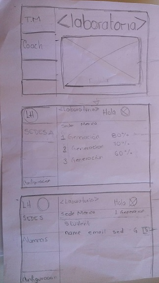
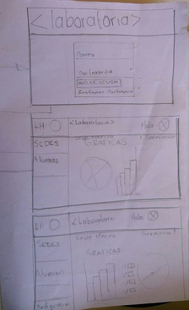
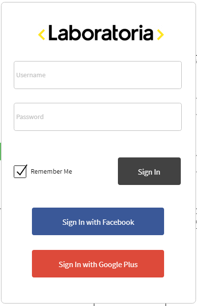
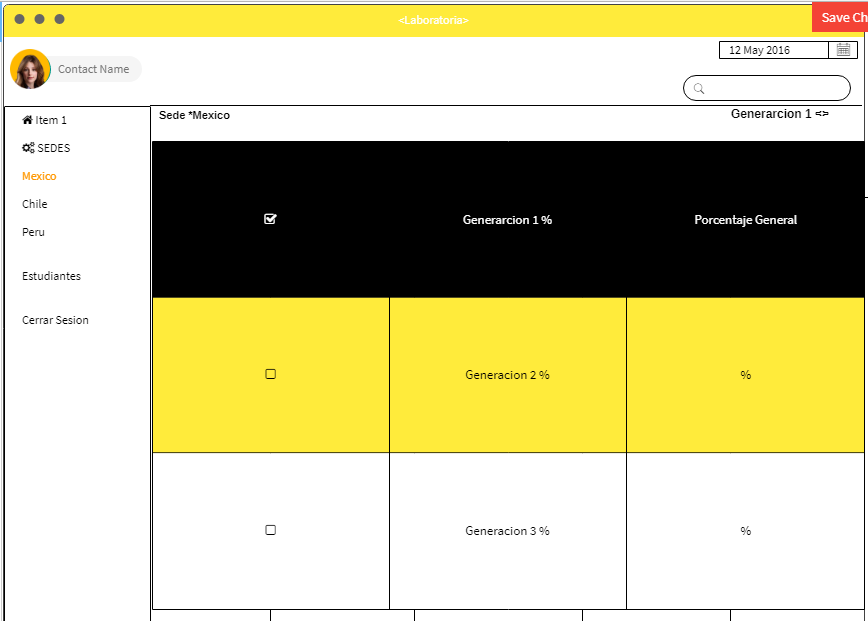
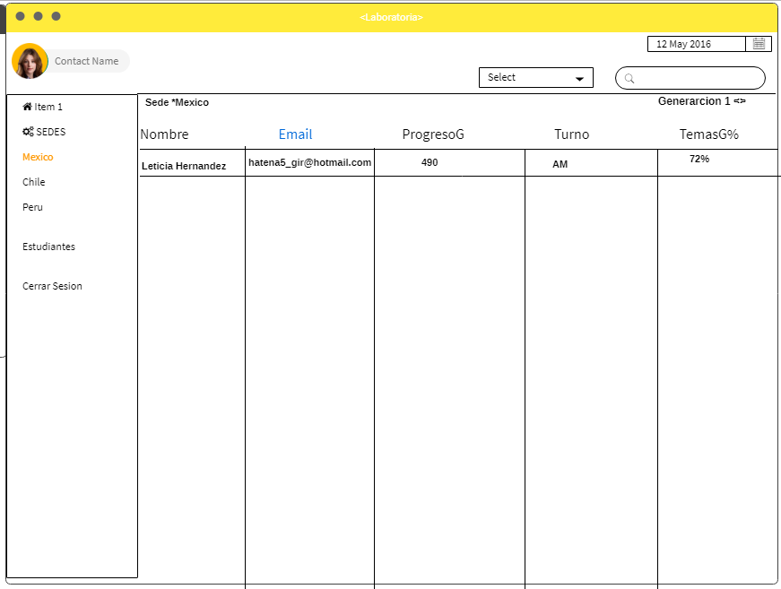
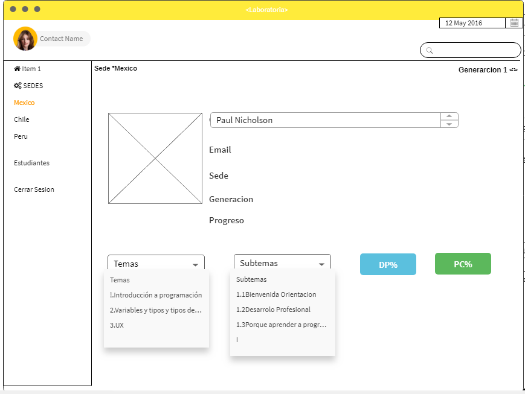

# **Data Dashboard**

## **Proceso de UX**

### **1. Descubrimiento e investigación**

Para poder recopilar todo la informacion realizamos [entrevistas]() que nos ayudaran a identificar el tipo de usuario a quien va dirigido nuestro proyecto y asi poder cumplir sus  necesidades.
Entrevistamos a los coach y Tm pues ellos son los que tienen mas interaccion con esta data, la informacion que mas utilizan  son las sedes y generaciones,resultados y desempeño de las alumnas , porcentajes alcanzados por cada una de ellas nos dimos cuenta que algunos tardan  mas de 5 horas interactuando con la informacion ,la organizacion de las carpetas no son muy agiles,ya que tienen que estar  buscando la informacion carpeta por carpeta y llegan a tardar demasiado tiempo buscando la informacion qu especificamente necesitan,la mayoria de ellos pasan mas tiempo en la computadora y cuando quieren utilizar la data en el celular se les hace aun mas complicado buscar algun dato.
El celular es  indispensale ya sea en nuestra vida social o en nuestra area de trabajo.Tambien nos comentaron que la informacion que visualizan solo les sirve una sola vez y cada que entran a la data esta cambia y tienen que volver a realizar el trabajo algo que se les hace muy abrumador nos dimos cuenta que ellos utilizan tablas y a algunos les gustaria visualizar la informacion en graficas pues tiene que contar manualmente el numero de egresadas que existen en la data,tambien les gustaria que su informacion se visualizara en forma ascendente y desendente para asi tener aun mejor organizacion en du data.

__Usuarixs:__

Tener mejor accesibilidad encuanto a los datos y poder tener la informacion mas organizada ,reducir el tiempo de busqueda,no cuenta con una interfaz utilizan un programa basico que es Excel,no cuentan con un proceso establecido.Que pudiera tener un perfil en laboratoria para poder saber quienes son, su cargo, sus nombres.
Les gustaria contar con una interfaz que se mucho mas eficiente, poder visualizar graficas pero solo si hay necesidad de usarlas pues prefieran algo sencillo y facil de usar.Comparten la informacion por Google Drive y Spreadsheets.
Algunos usuario si han tenido acceso a otra data dashboard y para ellos es muy accesible como es [Bamboohr HR](https://www.bamboohr.com/api/documentation/login.php)

__Bamboohr__

__Objetivos de las usuarias:__
sus obetivos es poder reducir el tiempo y tener una busqueda de cada estudiante aun mas eficiente y Planificar y ejecutar el programa de formación.
Mantener un seguimiento del progreso de las estudiantes y según ello tomar las decisiones
necesarias para ofrecerles la mejor experiencia de aprendizaje.
Para conocer cómo están avanzando, darles feedback constante sobre su desempeño y
facilitar su desarrollo.

__Sentimientos:__
desesperacion ,suelen abrumarse y enojo ,frustracion.

__Técnicas usadas en esta fase:__

 [Entrevistas]().

__5. Objetivos del negocio:__

Que las estudiantes construyan en 6 meses los skills técnicos y socioemocionales para
insertarse en el mundo tech e iniciar su carrera ,es el objetivos de Laboratoria a largo plazo, nuestra vision es ser la principal fuente de talento tech femenino de america latina para el mundo. Ofrecer una educación de calidad y encontrar
el talento que necesita el sector, encontrar a las mujeres talentosas que se necesitan para
cambiar el sector. También hacia afuera, formar el talento en empresas para que se
transforme digital incluyente, e interno que los laboratorians se sientan felices trabajando en
laboratoria y que tengan mapas de carrera claros y también atraer y mantener al mejor
talento, generar las oportunidades para que las mujeres puedan empezar su carrera en
tecnología.

__1. Cuáles crees que son los datos más importanteLa interfaz debe permitir al usuario:__

* Listar y poder seleccionar sedes
* Dentro de cada sede:
  * Listar y poder seleccionar generaciones
  * Para cada generación:
    * Listar y poder seleccionar estudiantes mostrando porcentaje general de completitud de c/estudiante
    * Seleccionar estudiantes mostrando reporte de progreso:
        * Mostrar porcentaje de completitud de todos los temas
        * Calcular porcentaje de tiempo completado de cada tema
        * Listar subtemas de cada tema
        * Poder filtrar subtemas completados y no-completados de cada tema
        * Poder filtrar subtemas por tipos (ejercicios, lecturas y quizzes)
  * En la vista de cada generación mostrar reporte de:
    * Promedio de la generación
    * Generar status para identificar estudiantes debajo del 60 en su porcentaje de completitud
    * Generar status para identificar estudiantes con 90 o más en su porcentaje de completitud
    * Poder filtrar estudiantes por estos dos status
    * Filtrar y poder buscar estudiantes por nombre
    * Poder ordenar de manera ascendente y descendente a las estudiantes según
    porcentaje de completitud
* Utiliza la interfaz sin problemas desde distintos tamaños de pantallas:
  móviles, tablets, desktops
* Realizar pruebas unitarias

 __2. Lo que los usuarios esperan obtener:__
    Una informacion bien organizada,nada de complejidad,y reduzca tiempo , que sea de gran utilidad,y que solo ellos puedan tener acceso a esa informacion ,poder acceder  en diferentes equipos sin tener ningun problema.

__3. Data proporcionada:__

*  Nombre respectivo de la estudiante.
*  Correo electrónico de la estudiante.
*  Sede a la cual la estudiante pertenece.
*  Generación a la cual la estudiante pertenece.
*  Un objeto con las siguientes propiedades:
 * Status para identificar si la estudiante esta por debajo del 60,
  en 90 o superándolo, o dentro de la media.

  * Sede a la cual la generación pertenece.
  * Generación a la cual pertence
  * Promedio del porcentajeCompletado de todas las estudiantes de la generación.
  * Número de estudiantes de la generación.

### **3. PROTOTIPADO**

### **Sketch:**
A primera instancia esta fue la idea que primero se nos vino ala mente conforme paso el tiempo y con las entrevistas que realizamos nuestra idea fue cambiando y nuestros Sketchs fueron cambiando,en esta etapa solo utilizamos ,hojas y lapiz.

Prototipo en invision: (Adjuntar liga)

__Prototipo de alta fidelidad__

Despues de terminar nuestro Sketch pasamos a realizar nuestro prototipo dijital  de alta fidelidad conforme a los datos
recabados y pensando siempre en las necesidades del Usuario i gaul que el sketch con forme alos test y el feedback recibido
vamos mejorando nuestra propuesta.

En esta etapa utiliamos  Mockflow y creamos nuestra cuenta,y tambien Invision,anexamos nuestra liga.

[prototipo](https://projects.invisionapp.com/d/main#/console/14731385/306312340/preview)

### **5. User testing**
(Si deseas validar tu propuesta, acércate a tu usuario y que te de feedback con el fin de mejorar tu producto en beneficio del negocio y de tu usuarix).
